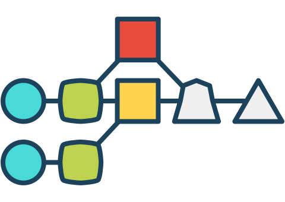
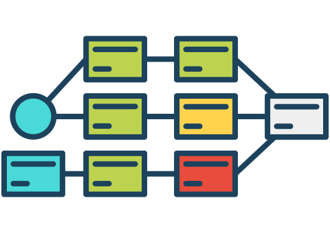
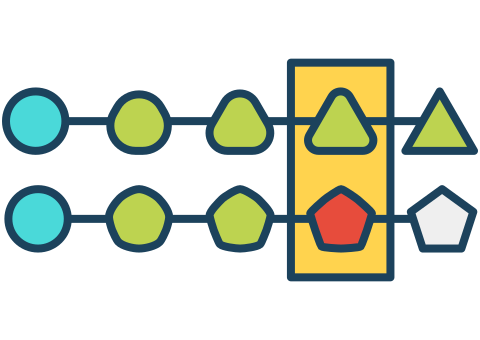

[EN](./README.md) | [中文](./docs/README_ZH.md)

    

## CI/CD on Kubernetes

:rocket: The practices of CI/CD on kubernetes.

---

## Gloabls

**End to End Visualization**

We need value stream map shows your entire path to production in a single view. Easily navigate across jobs, spot inefficiencies, and optimize your process. No plugin required, out of box CD.

     

**Cloud Native Deployments**

Should streamlines your CD workflow on popular cloud environments such as Kubernetes, Docker, AWS and more.

      

**Complex Workflow Modeling**

Excels at modeling complex CD workflows for fast feedback with its modeling constructs, parallel execution and dependency management. No plugin required, out of box CD.

     

**Advanced Traceability**

Helps you troubleshoot a broken pipeline by tracking every change from commit to deploy in real time. Compare content - both files and commit messages - across any two arbitrary builds. No plugin required, out of box CD.

     

---