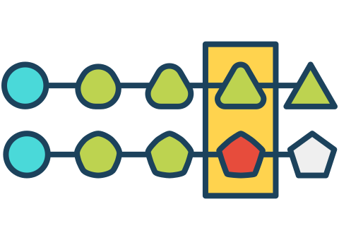

[EN](../README.md) | [中文](./docs/README_ZH.md)

    

## CI/CD on Kubernetes

:rocket: CI/CD 在kubernetes上的实践。

---

## 目标

**流程可视化**

可视化处理流程中的每一个步骤，无需额外的操作。

      

**云原生部署**

支持多种云平台Kubernetes、Docker、AWS等等。

      

**高阶控制流**

支持复杂的流程控制逻辑，形如，抽象模板、上下文、条件控制等等。

      

**问题追溯性**

出现损坏pipeline时，可追溯历史数据，并进行改动的对比与提交记录的查看。

    

---

另外，针对业务的使用，我们还需要支持一下特性：
1. **低接入成本**: 业务方在接入时，可以做到无缝接入，而无需关心过多的概念和参数。
2. **无组件震荡传导**: 向下兼容。在后端系统及组件做变更或替换时，业务方无需跟随学习和理解针对已有概念的变更。
3. **稳定快速**: 尽可能的优化稳定性和效率。

## 特点

* 👌 **一键**安装部署
* ️⚡️️ **生产**直接可用
* 🌱 **多种**组件支持

## 设计

### 组件图

一个应用的构建完整生命周期可以定义为从代码提交至部署安装。

该过程如下图，

过程中所涉及的组件如下图，

### 主要名词、组件和模块

1. **Component**: 任何形式存在的服务或执行程序，包含运行脚本；
2. **GitLab**: 指代码托管仓库，考虑到自身的场景，首选自部署[GitLab](https://gitlab.com)；
3. **WebHook**: 携带指定信息的HTTP请求，如，代码仓库发起的会携带项目地址、分支、Commit信息等数据；
4. **Cloud App Engine**: 容器云应用引擎；
5. **Trigger**: 触发动作，根据部署的方式而不同，可能为RPC，HTTP或命令行调用等方式；
6. **CI Components**: CI组件，不限定CI组件，可以为多种CI引擎，如，Jenkins、Drone、TektonCD等；
7. **Artifact Repos**: 物料仓库，构建好的镜像和打包好的应用程序；
8. **Sync**: 同步，从仓库A同步到仓库B，
   > 可选过程，见上图右下角灰色虚线所示。
9.  **Deploy**: 部署，部署过程会根据目标平台不同而存在差异，大致上为，
    1.  拉取镜像或应用
    2.  同步配置文件
    3.  应用镜像或应用和配置文件

虚线框的说明：
1. 中上部黄色: 在应用编排集群内；
2. 左下部橙色: 当前在应用编排集群外，可在集群内；
3. 右中部绿色: 应用的部署目标；
4. 最右侧灰色: 为非应用编排集群范围。

### 数据流说明

我们从一个Commit提交到最终应用的部署来逐步分析整个处理的过程。

0. 用户提交代码到代码仓库；
1. 代码仓库Webhook通知到应用引擎；
2. 应用引擎根据触发条件决定是否触发CI，如有必要生产出以下文件，
    1. Dockerfile
    2. Pipelines，**对应到CI组件所支持的输入格式**
3. CI执行Pipelines，
   > 1. 构建过程可以直接由CI执行，也可以通过触发构建组件;
   > 2. 可以在CI步骤中上传构建产出物；
4. 具体构建并测试，通知结果，更新版本信息；
5. 持续部署至测试环境并测试，通知测试结果；
6. 测试成功后，同步构建产物到正式物料库，并更新版本信息；
7. 持续部署到预发布环境，并通知；
8. 新建（持续）部署任务到正式环境，并通知。

### 控制模型

所有的过程，都可以由一个预定好的配置文件或信息进行生产或干预。模型包含以下部分，
1. 测试
2. 构建
3. 部署（多环境）
4. 触发条件
5. 数据更新

### 缓存设计

TODO

## 已达目标及问题

WIP